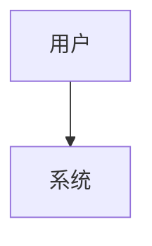

# 系统架构

## 架构图

```mermaid
graph TB
    User[用户] --> System[系统]
```

## 模块列表

### 示例模块
- **完成度**: 0%
- **测试评分**: 0/10
- **代码路径**: src/
- **状态**: 未开始

## 技术栈
- 语言: 
- 框架: 
- 工具: 

## 匹配度
<!-- 自动更新：代码与架构的匹配程度 -->
当前匹配度: 0%
最后更新: 未开始
